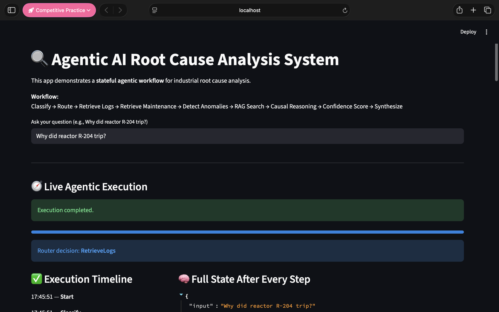
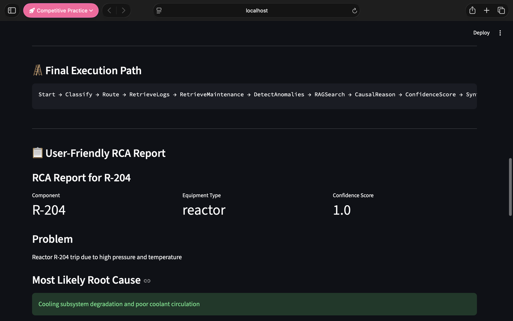

# 🔍 Agentic AI Root Cause Analysis System

A stateful **Agentic AI** workflow for industrial **Root Cause Analysis (RCA)** built using **LangGraph**, **Groq LLM**, **FAISS**, **SentenceTransformers**, and **Streamlit**.

This project simulates how an AI-driven diagnostic assistant can analyze equipment failures by combining:

- structured sensor logs
- maintenance history
- anomaly detection
- semantic retrieval from SOPs / incident reports
- LLM-based causal reasoning

---

## 🚀 Overview

In industrial environments such as chemical, pharma, or manufacturing plants, identifying the root cause of a failure can take significant time. Engineers usually need to inspect:

- process logs
- alarms
- maintenance records
- standard operating procedures
- historical incident reports

This project automates that reasoning workflow through a **multi-agent LangGraph pipeline**.

---

## 🚀 Live Demo

[Try the app on Hugging Face Spaces](https://huggingface.co/spaces/kunalkurve219/rca-agentic-ai)

## 📸 Screenshots

### Live Agentic Execution


### Final RCA Report


---

## ⚙️ Workflow

The system executes the following agentic workflow:

```text
Classify → Route → Retrieve Logs → Retrieve Maintenance → Detect Anomalies → RAG Search → Causal Reasoning → Confidence Score → Synthesize
```

What each stage does

- Classify
Detects intent, equipment component, equipment type, and severity.

- Route
Decides whether to run the full RCA pipeline or return a guarded response for unsupported queries.

- Retrieve Logs
Fetches structured sensor log data for the component.

- Retrieve Maintenance
Loads recent maintenance history for the component.

- Detect Anomalies
Flags abnormal pressure, temperature, vibration, and trip events.

- RAG Search
Retrieves relevant SOPs and historical incident documents using vector similarity search.

- Causal Reasoning
Uses Groq-hosted LLM to infer the most likely root cause from all available evidence.

- Confidence Score
Assigns a lightweight confidence score to the RCA output.

- Synthesize
Produces the final user-friendly RCA report.

## 📌 Problem

In industrial settings like chemical or pharma plants, root cause analysis of equipment failures can take hours or days. Engineers must inspect:

- sensor logs
- alarm events
- maintenance history
- SOPs and historical incident reports

This project automates that workflow using an agentic AI pipeline.

### 🧠 Why this is Agentic AI

This is not a single prompt-to-answer LLM app.

It is a stateful multi-step workflow where specialized agents collaborate through a shared state:

- one agent classifies the query
- another routes execution
- others retrieve structured and unstructured evidence
- one agent performs reasoning
- another scores confidence
- the final agent synthesizes the result

The app also exposes the live execution trace, making the internal agentic flow visible to the user.

### 📊 Features

- Multi-agent orchestration using LangGraph
- Conditional routing for supported vs unsupported queries
- Structured sensor log retrieval from CSV
- Maintenance history retrieval
- Threshold-based anomaly detection
- RAG over SOPs / incident reports using FAISS
- LLM-based RCA reasoning using Groq
- Full-state streaming after every step
- User-friendly RCA report
- JSONL logging for traceability
- Evaluation pipeline for ground-truth comparison

### 🖥️ Demo UI

The Streamlit app shows:
- live execution timeline
- router decision
- full state after each step
- final execution path
- user-friendly RCA report
- raw final JSON/state for debugging

Example query:
Why did reactor R-204 trip?

Example final result:
- Component: R-204
- Equipment Type: reactor
- Most Likely Root Cause: Cooling subsystem degradation and poor coolant circulation
- Confidence: high
- Supporting Evidence: temperature spike, pressure rise, anomaly detection, supporting SOPs

### 🗂️ Project Structure
```text
rca-agentic-ai/
│
├── agents/
│   ├── query_classifier.py
│   ├── router.py
│   ├── data_retriever.py
│   ├── maintenance_retriever.py
│   ├── anomaly_detector.py
│   ├── rag_retriever.py
│   ├── causal_reasoning.py
│   ├── confidence_scorer.py
│   └── final_synthesizer.py
│
├── data/
│   ├── sensor_logs.csv
│   ├── maintenance_history.csv
│   ├── ground_truth.json
│   └── sop_docs/
│       ├── reactor_sop.txt
│       ├── pump_sop.txt
│       └── cooling_failure_report.txt
│
├── embeddings/
│
├── utils/
│   ├── build_index.py
│   ├── logger.py
│   └── parser.py
│
├── app.py
├── langgraph_flow.py
├── evaluate.py
├── visualize_graph.py
├── requirements.txt
├── .gitignore
└── README.md
```

## ⚙️ Architecture

The system is built as a **stateful multi-agent workflow** orchestrated using **LangGraph**.

```text
Query Classifier
      ↓
Router
      ↓
Log Retriever
      ↓
Maintenance Retriever
      ↓
Anomaly Detector
      ↓
RAG Retriever
      ↓
LLM Causal Reasoning
      ↓
Confidence Scorer
      ↓
Final Synthesizer
```

### 🤖 Agents

- Query Classifier: Detects query intent, equipment component, equipment type, and severity.
- Router: Determines the execution path for the query using conditional edges in LangGraph.
- Log Retriever: Fetches structured sensor log data for the detected equipment.
- Maintenance Retriever: Retrieves recent maintenance history associated with the equipment.
- Anomaly Detector: Identifies abnormal pressure, temperature, vibration, or trip events using rule-based thresholds.
- RAG Retriever: Performs semantic search over SOPs and historical incident reports using FAISS and SentenceTransformers.
- Causal Reasoning: Uses a Groq-hosted LLaMA model to infer the most likely root cause from logs, anomalies, maintenance data, and retrieved documents.
- Confidence Scorer: Assigns a confidence score to the RCA output based on reasoning signals and detected evidence.
- Final Synthesizer: Generates a structured RCA report and a user-friendly explanation of the findings.

### 🔁 Example Execution Path

For a supported RCA query:

Start → Classify → Route → RetrieveLogs → RetrieveMaintenance → DetectAnomalies → RAGSearch → CausalReason → ConfidenceScore → Synthesize

For unsupported queries:

Start → Classify → Route → Synthesize


### 🧰 Tech Stack

- Python
- LangGraph — multi-agent workflow orchestration
- Streamlit — interactive UI
- Groq LLM — causal reasoning
- SentenceTransformers — text embeddings
- FAISS — vector search
- pandas — structured data retrieval
- JSON / CSV — datasets and evaluation inputs

### 🚀 How to Run

- 1. Open the folder in terminal
cd rca-agentic-ai 
- 2. Switch the Python Environment
python -m venv venv 
- 3. Activate the environment
source venv/bin/activate 
- 4. Install dependencies
pip install -r requirements.txt
- 5. Create .env
GROQ_API_KEY=your_groq_api_key_here
GROQ_MODEL=llama-3.1-8b-instant
- 6. Build vector index
python utils/build_index.py
- 7. Run app
streamlit run app.py
- 8. Run evaluation
python evaluate.py

### 🧪 Evaluation

The project includes a lightweight evaluation pipeline using ground_truth.json.

It compares:

- expected root cause
- predicted root cause
- similarity score

This helps measure whether the generated RCA aligns with known failure causes.

### 📌 Example Supported Queries

```text
Why did reactor R-204 trip?
Why did pump P-101 fail?
```
Example unsupported query:
```text
Hello, what can you do?
```
For unsupported queries, the router directs execution to a guarded synthesis path instead of the full RCA pipeline.

### 🔮 Future Improvements

Potential upgrades for future versions:

- replace threshold anomaly detection with ML-based anomaly models
- connect to real telemetry or historian databases
- add richer routing and branching paths
- support more equipment types
- improve confidence scoring calibration
- deploy with persistent observability and dashboards

### 👨‍💻 Author

Kunal Kurve
AI Engineer | NLP | GenAI | Agentic AI | RAG Systems